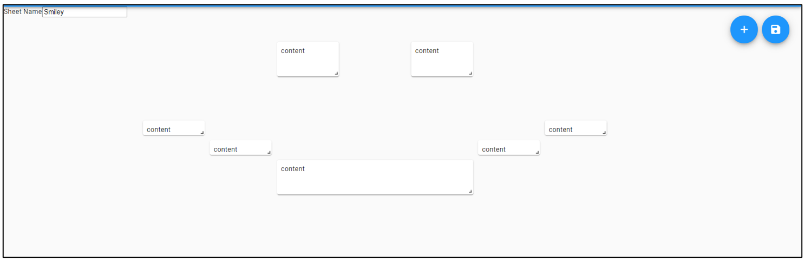

# Overview

## Login

Login.png shows the login screen for out application.

On the login screen is the username and password fields that users need to fill in to be authenticated and logged in.
The form includes two buttons:
1. Login
The login button redirects the user to the Home page of the user. Which has all their saved Notes and Sheets.
2. Register
The Register button takes you to Register form.  

## Login Errors

Login Errors: Error messages appear when the fields are empty in red.

<!--    -->

## Register

Regiser.png shows the registration page, where new users are able to create an account

It includes three input fields:

- Username: Where the user inputs their chosen username

- Password: Where the user inputs their chosen password

- Repeat Password: Where the user repeats their password

<!--  -->

## Header

Header.png is the navigation bar of the application.

Through it the user is able to navigate through the application and change what is being shown on the web page.

The Header includes the Title/Logo and the Login button

Once the user is logged in, the header changes to include additional options/buttons.

The login button has been replace with a User button, showing which user is currently logged in.

Additionally, a SHEETS button has been added in the middle of the header, which allows the user to be redirected to the sheets page.

## Logout

Lougout.png illustrates how the logout is displayed for the user.

It shows which user is logged in as well as giving the user the option to logout or return to the home page.

## Footer

The Footer is displayed on all pages.
It displays every member of the team as well as the title of the application.

<!--  -->

## Notes

Notes.png displays the currently display sheet and its contents.

Each Note is moveable across the screen, with the user being able to change the size of each note individually as well.
This allows each user to customise and place their notes however they like.

within Notes.png we can we that the user is using the Sheet called "Smiley" and the notes within that sheet have been loaded.

On the right hand side, at the top right we can see two blue buttons:

1. plus (+): When pressed, new notes are created for the user within the current sheet
2. Save (floppydisk): When pressed, saves the current sheet.

Each Note includes a text editor that allows for a broad variety of rich text composition experiences, allowing the users both basic text styles all the way to embedded media.

To edit a note, double click the note in question. Once you have done so, a editable text block appears.
Once done, just click outside of the text box.
It works with multiple cards whilst saving/loading.

We used [Draft.js](https://draftjs.org/) for the text editor

## Sheets

Sheets.png shows the sheets page where the user is able to pick a sheet to open it and see its saved Notes(contents)

Each user has their own list of saved sheets, which are saved to MongoDB. Whenever the user saves a sheet it will be added to the list 
on the top left. Each sheet when clicked directs the user into the sheet.

Under all the sheets is a link to create another sheet.

<!--  -->

## Brought to you buy Team X:
### - Thomas Clark
### - Matthew Evangelidis
### - Suphichaya Chaochuangchot
### - Justin Erasmus

